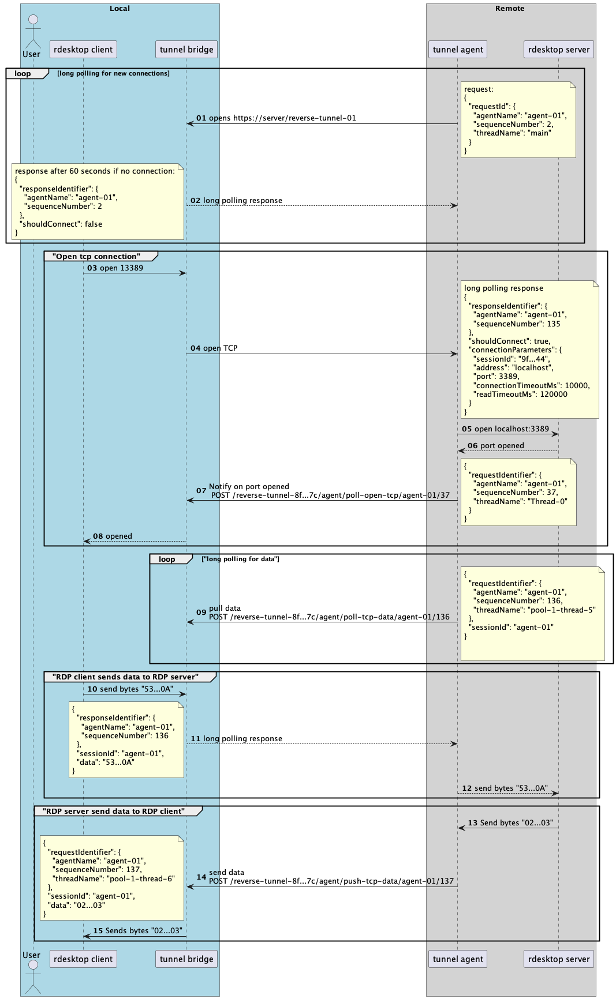

The application allows make a connection 
to the server behind a firewall.

## Diagram



## Hot it works

01. agent application open https://bridge/reverse-tunnel-01 to start long polling loop

02. if there is no any event it returns a wait response

```json
{
  "requestId": {
    "agentName": "agent-01",
    "sequenceNumber": 2,
    "threadName": "main"
  }
}
```

If bridge wants to open a connection it response with:

```json
{
  "responseIdentifier": {
    "agentName": "agent-01",
    "sequenceNumber": 135
  },
  "shouldConnect": true,
  "connectionParameters": {
    "sessionId": "9f...44",
    "address": "localhost",
    "port": 3389,
    "connectionTimeoutMs": 10000,
    "readTimeoutMs": 120000
  }
}
```


03. rdesktop client opens connection to RDP server via bridge application

04. bridge response with open connection reply to in long polling loop

```json
{
  "responseIdentifier": {
    "agentName": "agent-01",
    "sequenceNumber": 135
  },
  "shouldConnect": true,
  "connectionParameters": {
    "sessionId": "9f...44",
    "address": "localhost",
    "port": 3389,
    "connectionTimeoutMs": 10000,
    "readTimeoutMs": 120000
  }
}
```

05. agent receives open connection response and connects to the RDP server

06. tcp port is opened

07. agent send a notification to the bridge that port is opened

08. bridge responses to the rdesktop client: port is opened successfully

09. agent starts a new thread for long polling for the data

10. rdesktop client wants to send bytes to the RDP server. First it sends bytes to the bridge.

11. bridge responses with data in the long polling loop

```json
{
  "responseIdentifier": {
    "agentName": "agent-01",
    "sequenceNumber": 136
  },
  "sessionId": "agent-01",
  "data": "53...0A"
}
```


12. agent send bytes to the RDP server

13. RDP Server wants to send bytes to the client

14. agent POST data to the bridge /reverse-tunnel-8f...7c/agent/push-tcp-data/agent-01/137

15. bridge sends data to the rdesktop client
